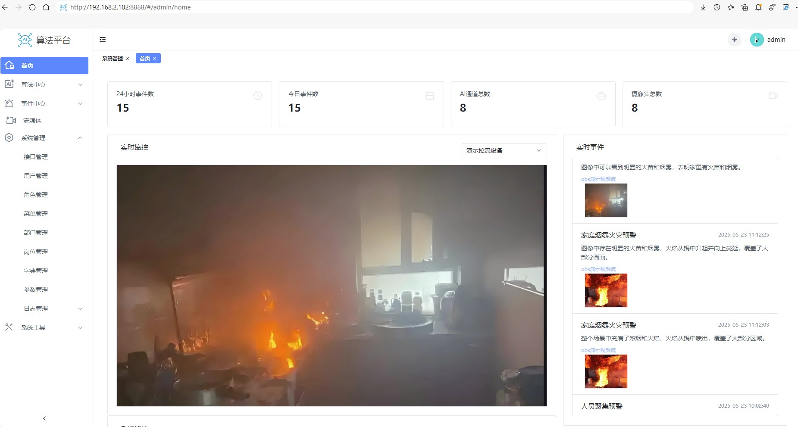
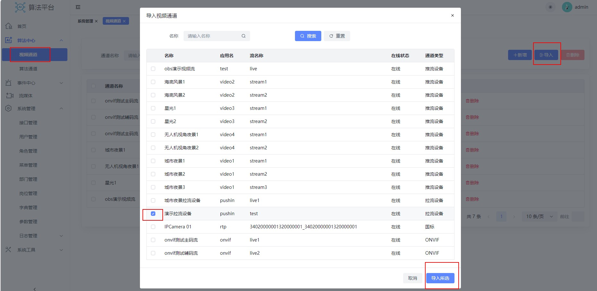
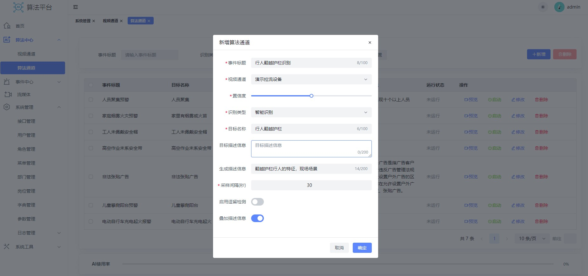
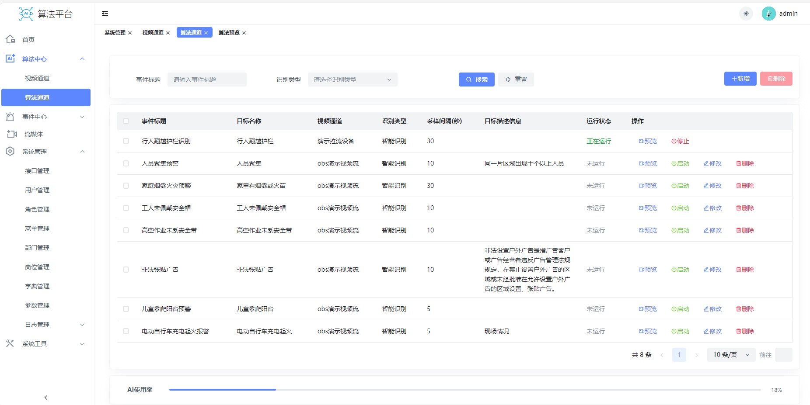
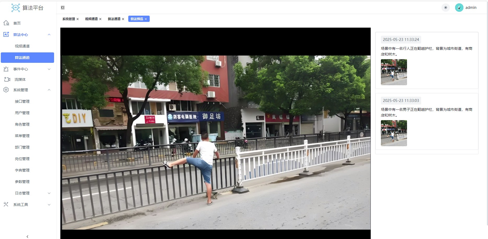
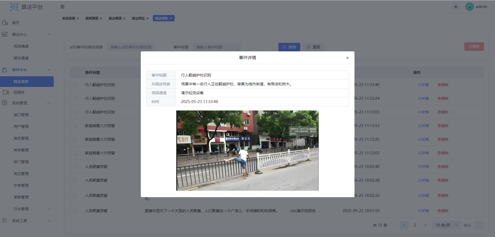

# 登录

默认端口8888，访问方式http://ip:8888，默认用户名admin 默认密码admin。

# 新增视频通道

视频通道-》导入-》勾选对应的视频-》导入所选

视频通道可以直接从流媒体平台导入 （推荐直接导入），也可以通过填写rtsp和flv地址新增

# 算法配置

算法通道-》新增-》填写信息-》确定

示例：

我们需要识别行人翻越护栏的违法行为，所以目标写行人翻越护栏，如果目标名称不能描述清楚可以在目标描述信息里面将目标定义描述清楚

* 生成描述信息：希望大模型藐视目标的哪些信息

* 采样间隔： 每个多少秒识别一次
* 启用逗留检测： 如果启用，第一次识别到不会触发事件，只有在间隔n个采样间隔后还是能识别到才会触发
* 叠加描述信息： 天图片上添加对目标的描述

配置完成后点击启用

点击预览按钮预览算法执行

# 事件中心

点击算法事件，查看所有的算法事件

